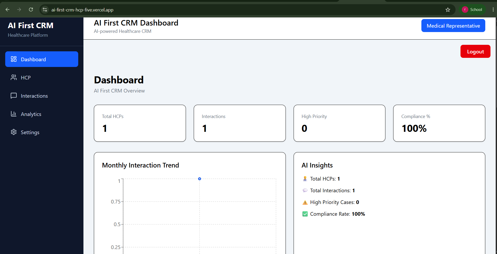
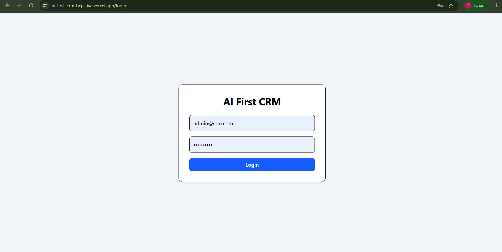
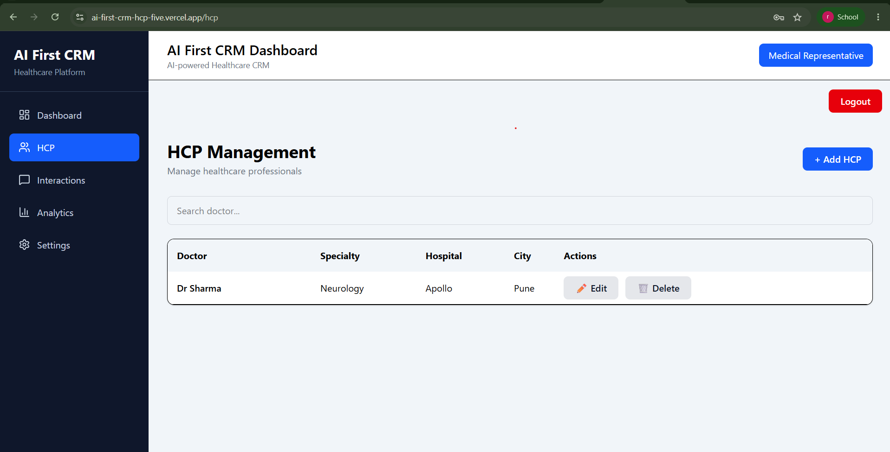
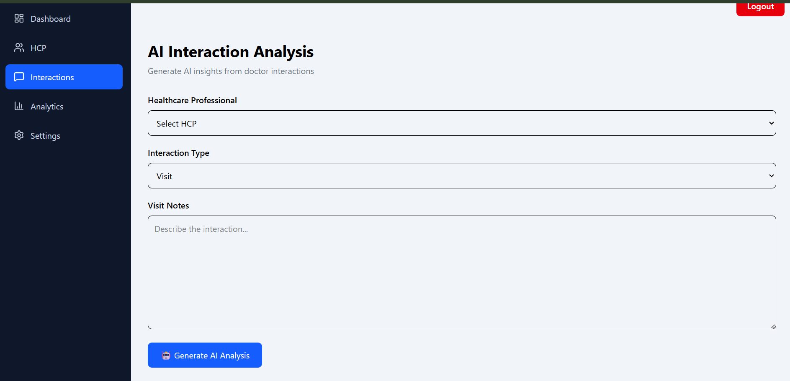
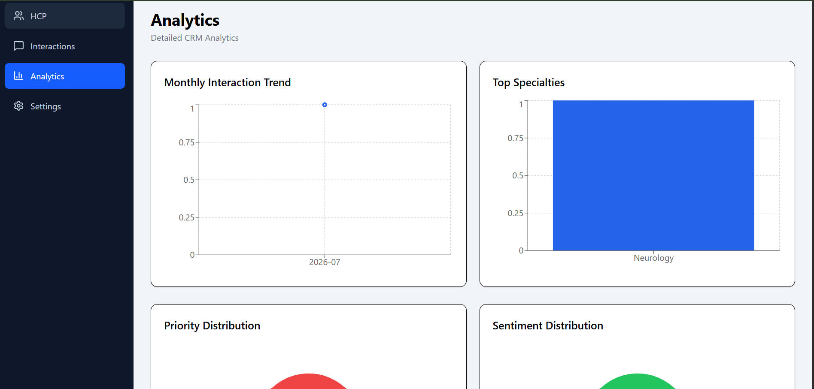
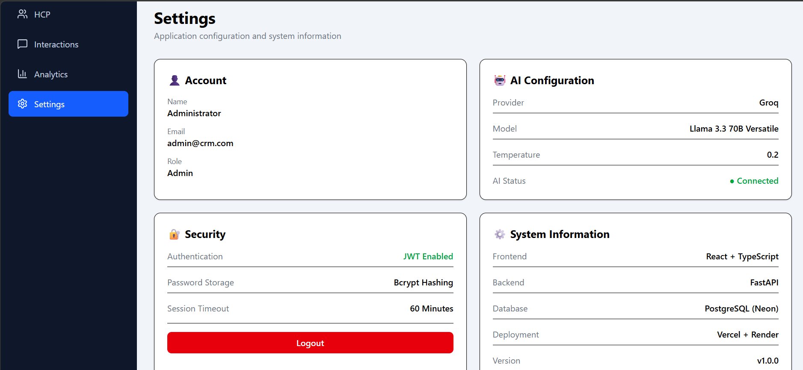

# 🏥 AI-First CRM for Healthcare Professionals (HCP)

> AI-powered Customer Relationship Management system built using React, FastAPI, LangGraph, Groq LLM, and PostgreSQL.

## 🌐 Live Demo

Frontend:
https://ai-first-crm-hcp-five.vercel.app

Backend API:
https://ai-first-crm-hcp-zbkg.onrender.com/docs

## 📌 Project Overview

AI-First CRM is a modern Healthcare Professional (HCP) relationship management platform that leverages Large Language Models (LLMs) to intelligently analyze interaction notes.

The system automatically:

- Summarizes conversations
- Detects sentiment
- Classifies interaction priority
- Performs compliance checks
- Recommends follow-up actions

Unlike traditional CRMs, AI is integrated directly into the workflow, enabling healthcare teams to capture actionable insights without manual analysis.

## Key Features

| Module         | Features                            |
| -------------- | ----------------------------------- |
| Authentication | JWT Login, Protected Routes, Logout |
| HCP            | Add, Edit, Delete, Search           |
| Interaction    | AI Analysis, History, Filters       |
| Dashboard      | KPIs, Charts, Trends                |
| Analytics      | Priority, Sentiment, Specialties    |
| Settings       | Account, AI Config, Security        |

## 📸 Application Screenshots

Login Page

Dashboard

HCP Management

Interaction Form

Analytics

Settings

## AI Workflow

User submits interaction

        │

        ▼

FastAPI API

        │

        ▼

LangGraph Workflow

        │

        ▼

Groq LLM

        │

        ▼

Extract

• Summary

• Sentiment

• Priority

• Compliance

• Follow-up

        │

        ▼

Save into PostgreSQL

        │

        ▼

Dashboard & Analytics

## Architecture

React + TypeScript

        │

REST API

        │

FastAPI

        │

LangGraph

        │

Groq LLM

        │

SQLAlchemy

        │

PostgreSQL (Neon)

## Technology Stack

React

TypeScript

FastAPI

Python

LangGraph

Groq

JWT

Tailwind

SQLAlchemy

PostgreSQL

Neon

Render

Vercel

## Folder Structure

backend/

app/

api/

auth/

models/

schemas/

services/

frontend/

src/

components/

features/

pages/

hooks/

## Installation:-

# Backend

cd backend

pip install -r requirements.txt

uvicorn app.main:app --reload

# Frontend

cd frontend

npm install

npm run dev

## Environment Variables

# Backend
DATABASE_URL=

SECRET_KEY=

JWT_ALGORITHM=

ACCESS_TOKEN_EXPIRE_MINUTES=

GROQ_API_KEY=

# Frontend

VITE_API_BASE_URL=

## AI Features

The AI engine automatically:

✔ Summarizes meeting notes

✔ Detects positive/neutral/negative sentiment

✔ Identifies interaction priority

✔ Performs compliance validation

✔ Suggests follow-up actions

✔ Stores structured insights into PostgreSQL

## Deployement

| Component | Platform        |
| --------- | --------------- |
| Frontend  | Vercel          |
| Backend   | Render          |
| Database  | Neon PostgreSQL |

## Future Improvements

Multi-user authentication
Role-based access control
AI Chat Assistant
Calendar integration
Email reminders
Report export (PDF/Excel)

## Author

Rushikesh Pravin Patil

LinkedIn:- https://www.linkedin.com/in/rushikesh-pravin-patil/

GitHub:- https://github.com/rushi935993

Portfolio:- https://ai-portfolio-pied-ten.vercel.app/